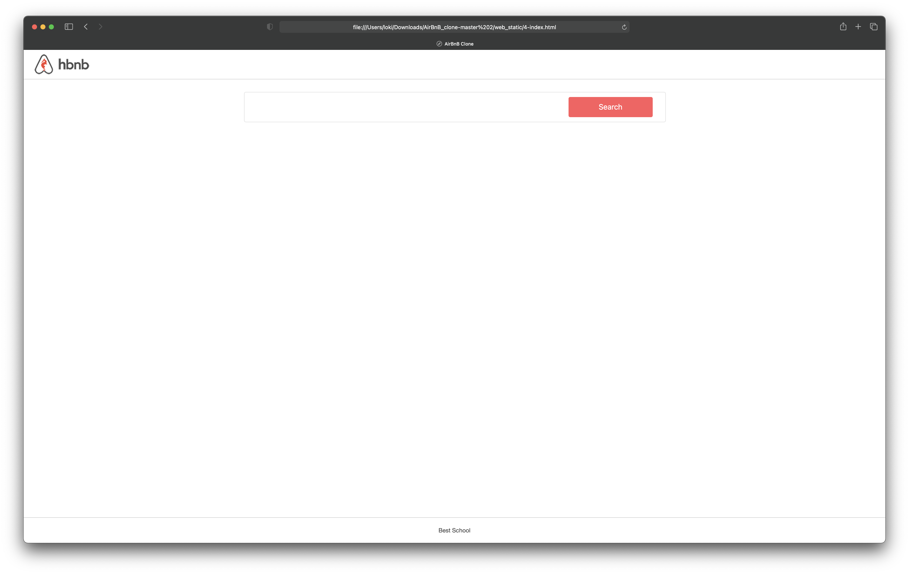
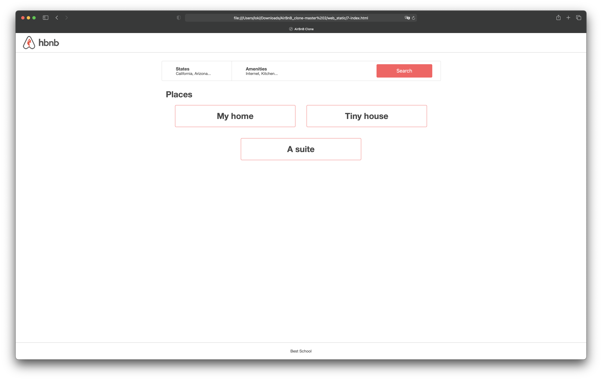
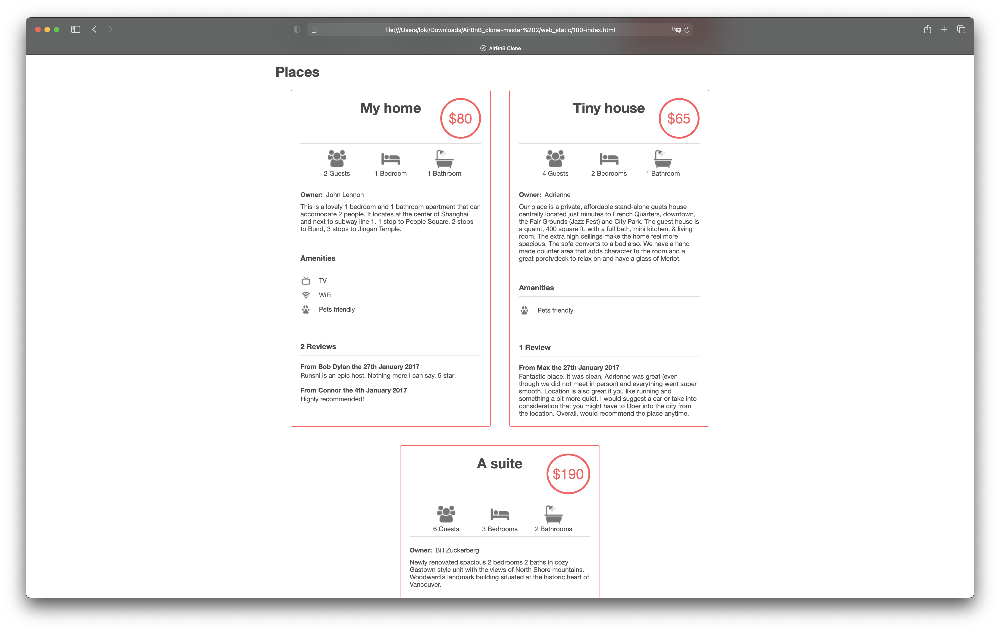

# AirBnB Clone - Web Static

## Project Overview

This project is part of the ALX SE Foundations curriculum and is led by Guillaume. It involves creating a static front-end for an AirBnB clone website. The goal is to learn how to manipulate HTML and CSS to build the structure and design of web pages.

## Table of Contents

1. [Concepts](#concepts)
2. [Background Context](#background-context)
3. [Learning Objectives](#learning-objectives)
4. [Requirements](#requirements)
5. [Tasks](#tasks)
6. [Resources](#resources)
7. [Copyright - Plagiarism](#copyright-plagiarism)

## Concepts

For this project, you are expected to look into the following concepts:

- HTML/CSS
- The trinity of front-end quality

## Background Context

**Web static, what?**

Now that you have a command interpreter for managing your AirBnB objects, it's time to make them come alive!

Before developing a big and complex web application, we will build the front end step by step. The first step is to "design," "sketch," or "prototype" each element, which includes creating simple HTML static pages, a style guide, and fake contents. No JavaScript will be used in this project, and no data will be loaded from external sources.

During this project, you will learn how to manipulate HTML and CSS languages. HTML is the structure of your page, so it should be the first thing to write. CSS is responsible for the styling, the design of your page. We encourage you to complete your HTML structure before working on the styling because without a proper structure, design cannot be applied.

Before you begin, please fork or clone the repository AirBnB_clone from your partner if you were not the owner of the previous project.

## Learning Objectives

By the end of this project, you should be able to explain the following concepts to anyone without the help of Google:

- What is HTML
- How to create an HTML page
- What is a markup language
- What is the DOM (Document Object Model)
- What is an element/tag
- What is an attribute
- How does the browser load a webpage
- What is CSS (Cascading Style Sheets)
- How to add style to an element
- What is a class
- What is a selector
- How to compute CSS Specificity Value
- What are Box properties in CSS

## Requirements

**General**

- Allowed editors: `vi`, `vim`, `emacs`
- All your files should end with a new line
- A `README.md` file, at the root of the project folder, is mandatory
- Your code should be `W3C` compliant and validate with `W3C-Validator`
- All your CSS files should be in the `styles` folder
- All your images should be in the `images` folder
- You are not allowed to use `!important` and ID (`#...`) selectors in the CSS file
- You are not allowed to use the HTML tags `img`, `embed`, and `iframe`
- You are not allowed to use `JavaScript`
- Current screenshots have been done on `Chrome 56` or later
- No cross-browser compatibility is required
- Follow all requirements; some `margin/padding` might be missing, so try to match the screenshots as closely as possible

## Tasks

### 0. Inline Styling

- Create an HTML page that displays a header and a footer with specific styling.
- Use inline styling for all your tags.
- The layout should include a header with a red background and a footer with a green background.
- The header should have a height of 70px, while the footer should have a height of 60px.
- The text "Best School" should be centered both vertically and horizontally within the footer.
- The text "Best School" should always be at the bottom of the page.

### 1. Head Styling

- Create an HTML page that displays a header and a footer with the same styling as the previous task.
- However, this time, you should use the `style` tag in the head of your HTML document.
- The layout should be identical to the one created in task 0.

### 2. CSS Files

- Create an HTML page that displays a header and a footer with styling similar to task 1.
- This time, you should use separate CSS files for different styles.
- The layout should be the same as task 1.

### 3. Zoning Done!

- Create an HTML page that displays a header and a footer with further styling changes.
- You should create a more detailed design using separate CSS files.
- The layout should include different styles for common elements, the header, and the footer.

### 4. Search!

- Create an HTML page that displays a header, a footer, and a filters box with a search button.
- You should apply specific styling to these elements.
- The layout includes a container, filter section, and a search button.
- Use specific selectors and classes for styling.

### 5. More Filters

- Create an HTML page that displays a header, a footer, and a filters box with additional location and amenity filters.
- This page includes styling for location and amenity filters with specific classes and content.

### 6. It's (h)over

- Update the Locations and Amenities filters to display a contextual dropdown when the mouse hovers over the filter.
- Use the `ul` and `li` tags for creating the dropdown elements.

### 7. Display Results

- Create an HTML page that displays a header, a footer, a filters box with a dropdown, and a results section.
- The "Places" section includes listings with specific styling and content.

### 8. More Details

- Add more information to a "Place" article, including price by night, information, user details, and a description section.
- Style these additional elements within the "Place" article.

### 9. Full Details (Advanced)

- Enhance the "Places" section by adding a list of amenities and reviews.
- Style these new sections and elements within the "Place" article.

### 10. Flex (Advanced)

- Improve the Places section by using Flexbox for all Place articles.
- Apply Flexbox styles to create a flexible layout for the Place articles.

### 11. Responsive Design (Advanced)

- Implement responsive design to ensure the page displays correctly on mobile and small screens.
- Ensure there's no horizontal scrolling and that the design adapts to different screen sizes.

### 12. Accessibility (Advanced)

- Enhance the page's accessibility support, focusing on color contrast and header tags.
- Ensure the website is accessible to all users, including those with disabilities.

## Resources

**Read or watch:**
- [Learn to Code HTML & CSS `(until “Creating Lists” included)`](https://intranet.alxswe.com/rltoken/T9KyiA6_Tm3Ny6oTn08S-A)
- [Inline Styles in HTML](https://intranet.alxswe.com/rltoken/7NdYbImFNofpB_FXXn3otg)
- [Specifics on CSS Specificity](https://intranet.alxswe.com/rltoken/z_OTPFCjmhXJJi7KJqBCbQ)
- [CSS SpeciFishity](https://intranet.alxswe.com/rltoken/orI812cozq-yd2769VdM_w)
- [Introduction to HTML](https://intranet.alxswe.com/rltoken/okP4V3RxFXHkEcQo19AnuQ)
- [CSS](https://intranet.alxswe.com/rltoken/Ir8Ka59FO6Z_vJQ-gkSG_w)
- [MDN](https://intranet.alxswe.com/rltoken/BpSXtcWOGH0UT4XLCoQyJg)
- [center boxes](https://intranet.alxswe.com/rltoken/Tlje4XYwyZbUfHkQWGi1WQ)

## Copyright - Plagiarism

You are responsible for creating the solutions to the tasks by yourself. Plagiarism is strictly forbidden, and any form of it will result in removal from the program. Do not publish any content related to this project.

---

Copyright © 2023 ALX, All rights reserved.
